# Back-end App - OpenClassrooms Project 12
**Develop a secured back-end architecture with Python and SQL**

---

## DESCRIPTION

This project was completed as part of the "Python Developer" path at OpenClassrooms.

The goal was to develop a secured back-end architecture, capable of:

- storing data in SQL database
- executing CRUD operations on all the differents objects : Contract, Client, Event and Collaborator
- communicating with the user by CLI interface
- providing permission according to the user role

The application must:

- allow the user to create, update, delete, display and filter objects according to his permission

---

## PROJECT STRUCTURE
<p align="center">
    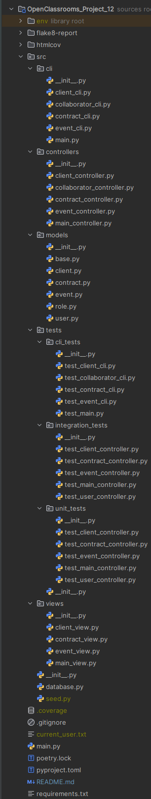
</p>

---

## INSTALLATION

- ### Clone the repository :

```
git clone https://github.com/Tit-Co/OpenClassrooms_Project_12.git
```

- ### Navigate into the project directory :
    `cd OpenClassrooms_Project_12`

- ### Create a virtual environment and dependencies :

1. #### With [uv](https://docs.astral.sh/uv/)

    `uv` is an environment and dependencies manager.
    
    - #### Install environment and dependencies
    
    `uv sync`

2. #### With pip

   - #### Install the virtual env :

    `python -m venv env`

   - #### Activate the virtual env :
    `source env/bin/activate`  
    Or  
    `env\Scripts\activate` on Windows  

3. #### With [Poetry](https://python-poetry.org/docs/)

    `Poetry` is a tool for dependency management and packaging in Python.
    
    - #### Install the virtual env :
    `py -3.14 -m venv env`
    
    - #### Activate the virtual env :
    `poetry env activate`

- ### Install dependencies 
  1. #### With [uv](https://docs.astral.sh/uv/)
      `uv sync` or `uv pip install -r requirements.txt`

  2. #### With pip
      `pip install -r requirements.txt` 

  3. #### With [Poetry](https://python-poetry.org/docs/)
      `poetry install`
  
     (NB : Poetry and uv will read the `pyproject.toml` file to know which dependencies to install)

---

## USAGE

### Launching server
- Open a terminal
- Go to project folder - example : `cd epic_events`
- Activate the virtual environment as described previously
- Create environment variables (to avoid to add raw DB details in the code)
  - With Power Shell :
    ```
    $env:DB_USERNAME = "user"
    $env:DB_PASSWORD = "password"
    $env:DATABASE = "epic_events"
    $env:HOST = "127.0.0.1"
    $env:PORT = "3307"
    $env:SENTRY_KEY = "my_key"
    ```
  - With Git Bash :
    ```
    export DB_USERNAME="user"
    export DB_PASSWORD="password"
    export DATABASE="epic_events"
    export HOST="127.0.0.1"
    export PORT="3307"
    export SENTRY_KEY = "my_key"
    ```

### Launching the APP
- Finally, launch the CLI app by typing commands : 
  - Examples
    - `python -m src.cli.main login`
    - `python -m src.cli.main collaborator create-collaborator` or `python -m src.cli.main collaborator create`
    - `python -m src.cli.main event display-event` or `python -m src.cli.main event display`
    - `python -m src.cli.main client filter-client` or `python -m src.cli.main client filter`
    - `python -m src.cli.main contract delete-contract` or `python -m src.cli.main contract delete`
    - `python -m src.cli.main collaborator logout`
    
---

## EXPLANATIONS OF WHAT THE APP DOES

### <u>Initialization</u>
- First the database is initialized and an admin manager is created. Only this first account can create the first collaborators.

### <u>Authentication</u>
- The user can log in the CLI by typing his e-mail and password

### <u>Creation</u>
- The user can create objects (Contract, Client, Event, Collaborator) by typing the proper command and according to his permission.
- Only managers can create some new collaborators and some new contracts.
- Only commercials can create some new clients or some new events.

### <u>Display</u>
- All user can display objects of any type.

### <u>Update</u>
- The user can update objects (Contract, Client, Event, Collaborator) by typing the proper command and according to his permission.
- Only technicians can update events.
- Only commercials can update clients.
- Only managers can update contracts and collaborators details

### <u>Deletion</u>
- The user can delete objects (Contract, Client, Event, Collaborator) by typing the proper command and according to his permission.
- Only managers can delete contracts, events and collaborators profile.
- Only commercials can delete clients.

### <u>Filtering</u>
- The user can filter objects (Contract, Client, Event, Collaborator) by typing the proper command and according to his permission.
- Only managers and technicians can filter events.
- Only commercials can filter contracts.
- All users can filter clients.

---

## CLI EXAMPLES

Here are some examples of results with views obtained when entering CLI commands.

- Authentication
<p align="center">
    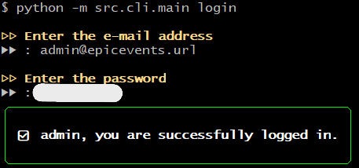
</p>

- Creation of a collaborator
<p align="center">
    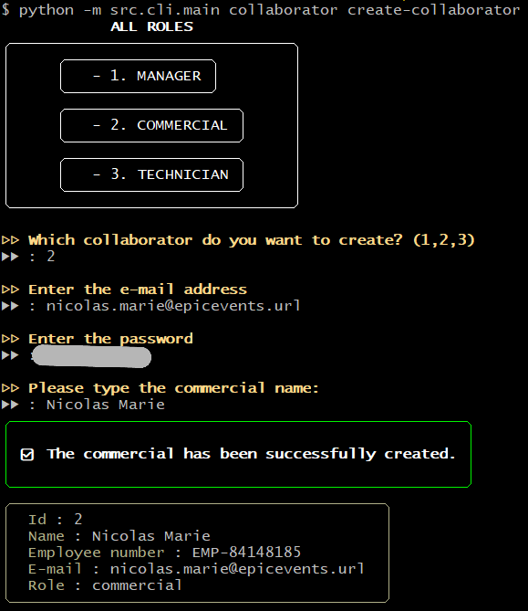
</p>

- Creation of a client
<p align="center">
    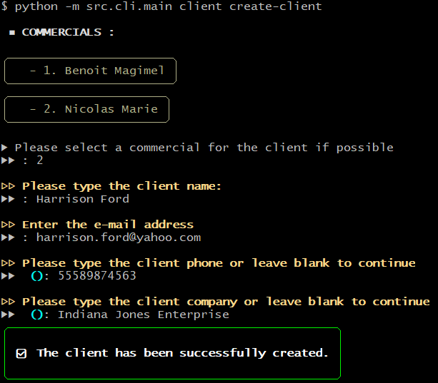
</p>

- Displaying a client
<p align="center">
    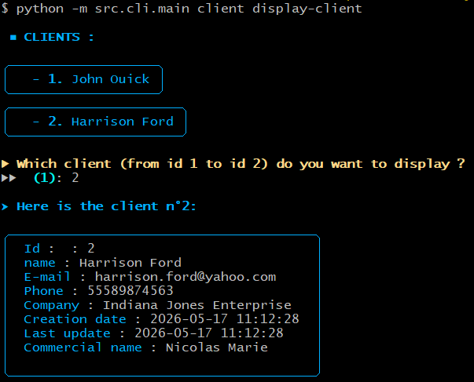
</p>

- Update of a client
<p align="center">
    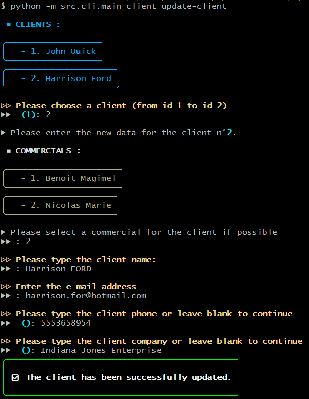
</p>

- Creation of a contract
<p align="center">
    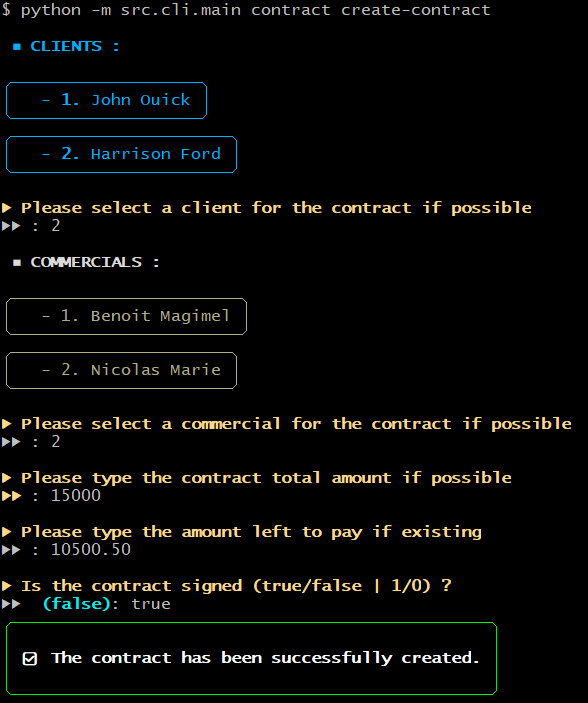
</p>

- Displaying a contract
<p align="center">
    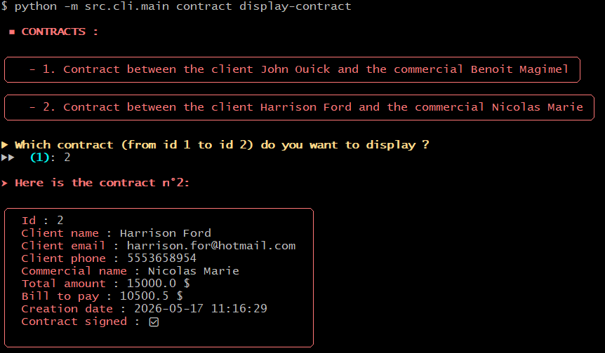
</p>

- Contract deletion impossible (when an event is still linked because an event can't exists on its own without a contract)
<p align="center">
    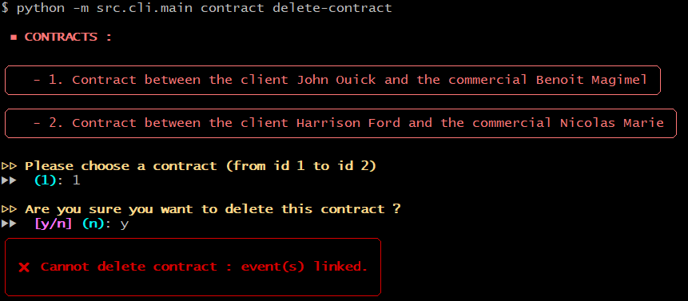
</p>

- Contract deletion possible
<p align="center">
    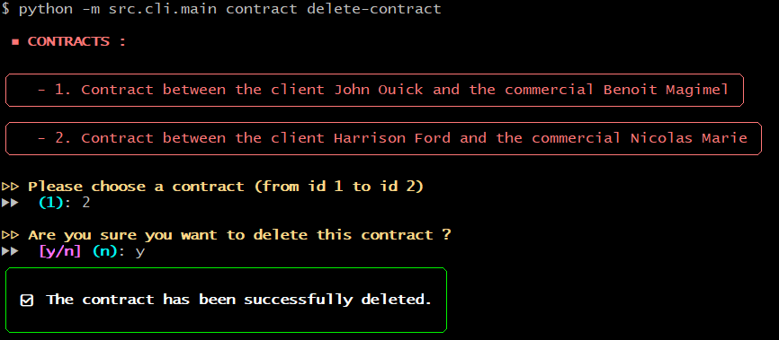
</p>

- Permission error when creating contract with wrong role (Commercial role in this case instead of Manager)
<p align="center">
    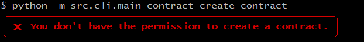
</p>

- Client filtering by name
<p align="center">
    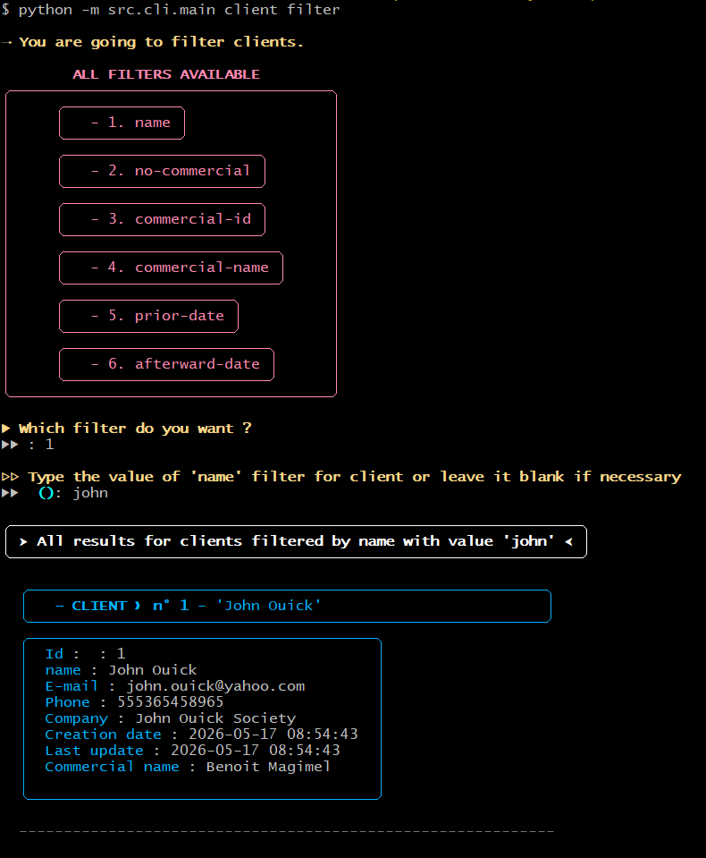
</p>

- Client filtering by prior-date (on creation date, i.e. in the results, the creation date is prior to the entered date)
<p align="center">
    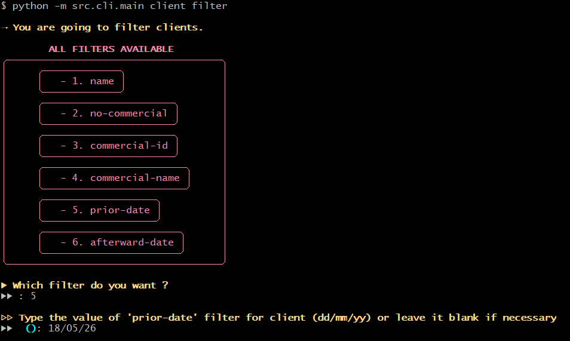
    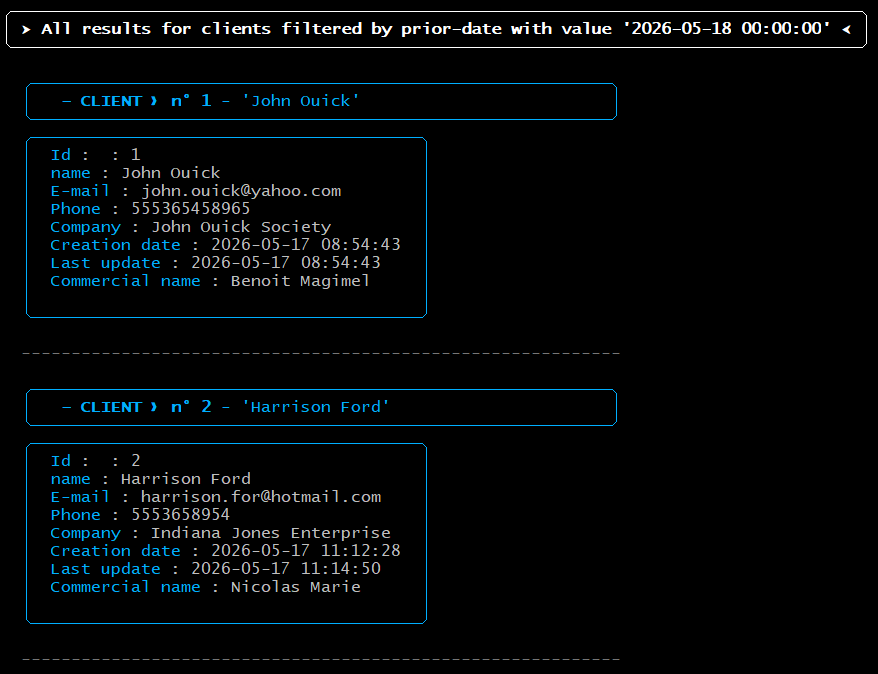
</p>

- Logout
<p align="center">
    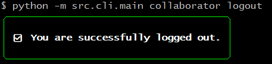
</p>

- Help command examples
<p align="center">
    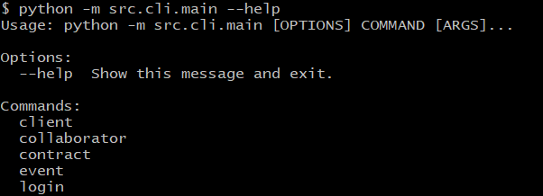
</p>
<p align="center">
    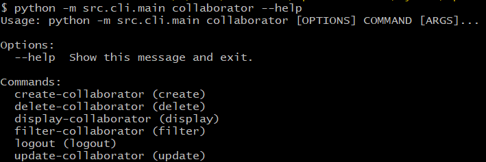
</p>

---

## PEP 8 CONVENTIONS

- Flake 8 report
<p align="center">
    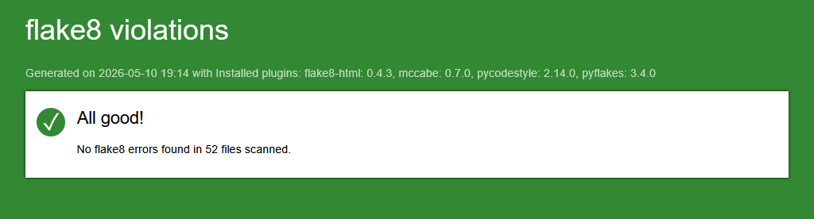
</p>

**Type the line below in the terminal to generate another report with [flake8-html](https://pypi.org/project/flake8-html/) tool :**

` flake8 --format=html --htmldir=flake8-report --max-line-length=119 --extend-exclude=env/ --ignore="E402, F821"`

- Imports sorting with isort

All libraries imports are sorted by type and alphabetically. I used the [isort](https://isort.readthedocs.io/en/latest/) 
library to do that in order to comfy Pep 8 conventions

**Type the line below in the terminal to generate another another sorting :**

` isort .` to sort all files in project folder. If needed, specify the file to sort : `isort <file>`

---

## TESTS COVERAGE WITH UNITTEST

- Coverage report
<p align="center">
    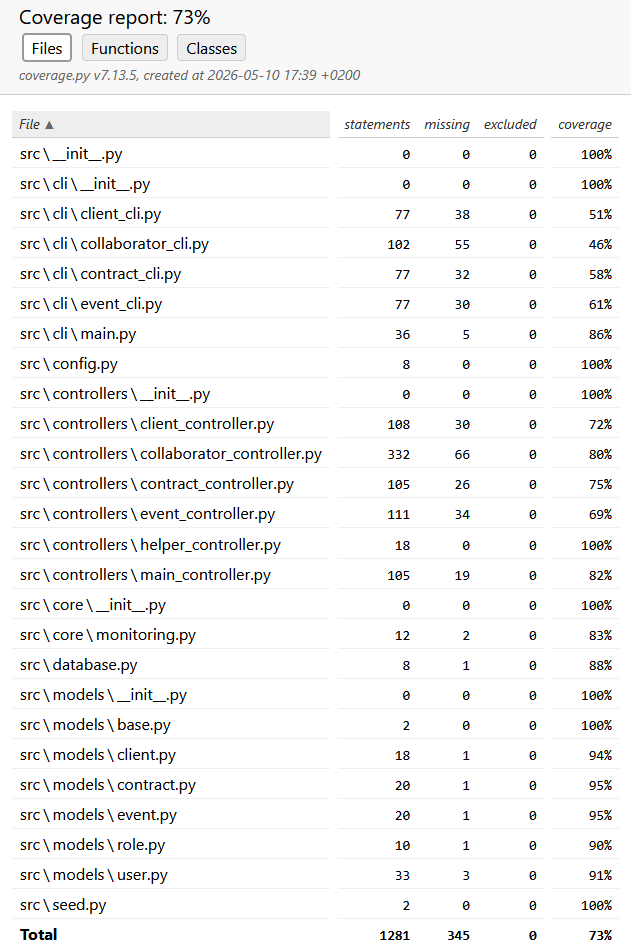
</p>

- **Type the lines below in the terminal to generate another coverage report with unittest**

    `python -m coverage run -m unittest discover -s src/tests`
    `python -m coverage html --omit=tests/*`

---


---

## AUTHOR
**Name**: Nicolas MARIE  
**Track**: Python Developer – OpenClassrooms  
**Project 12 – Develop a secured back-end architecture with Python and SQL – April 2026**
